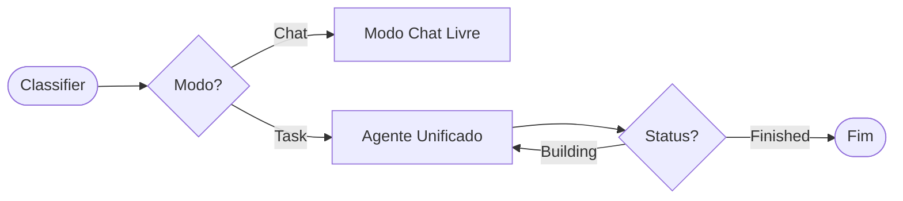

<div align="center">

# Trebuchet Framework v4.0

**Orquestração de Agentes Autônomos Local-First & Multi-Modal**

[](https://www.python.org/)
[](https://github.com/abetlen/llama-cpp-python)
[](https://langchain-ai.github.io/langgraph/)
[](LICENSE)

[Funcionalidades](#-funcionalidades) • [Instalação](#-instalação) • [Arquitetura](#-arquitetura) • [Plugins](#-sistema-de-plugins) • [Contribuição](#-contribuição)

</div>

---

## Sobre o Projeto

O **Trebuchet Framework** é uma infraestrutura robusta para a criação, execução e orquestração de Agentes de IA autônomos, projetada especificamente para **hardware local**. Diferente de soluções que dependem exclusivamente de APIs na nuvem, o Trebuchet prioriza a privacidade e o desempenho local utilizando `llama-cpp-python` para inferência de LLMs e `chromadb` para memória persistente.

A versão **v4.0** introduz uma arquitetura baseada em grafos (**LangGraph**), permitindo fluxos de trabalho complexos, alternância dinâmica entre modo "Chat" e "Agente", e um sistema de ferramentas totalmente modular.

### Destaques
* **Local Intelligence First:** Otimizado para executar modelos GGUF (Llama, Mistral, Gemma) via CPU ou GPU (CUDA).
* **Graph-Based Workflow:** Lógica de decisão de estado gerenciada pelo LangGraph, permitindo loops de raciocínio, recuperação de erros e planejamento complexo.
* **Multi-Modal Nativo:** Capacidades integradas de **Visão Computacional** (OpenCV/VisionTool), **Audição** (Faster-Whisper) e **Fala** (TTS).
* **Controle de Desktop:** Ferramentas nativas para interação com o SO (Shell, Automação de UI com PyAutoGUI).
* **Arquitetura de Plugins:** Carregamento dinâmico de ferramentas personalizadas sem alterar o núcleo.

---

## Instalação

Devido à natureza de alto desempenho e dependências de sistema (compilação C++), siga os passos abaixo rigorosamente.

### Pré-requisitos
* **Python 3.10+**
* **Compilador C++:**
    * *Windows:* Visual Studio Build Tools (C++ Workload).
    * *Linux:* `build-essential`.
* *(Opcional)* Drivers NVIDIA CUDA para aceleração de GPU.

### Passo a Passo

1.  **Clone o Repositório**
    ```bash
    git clone https://github.com/caioross/trebuchet.git
    cd trebuchet
    ```

2.  **Ambiente Virtual**
    ```bash
    python -m venv venv
    # Windows
    .\venv\Scripts\activate
    # Linux/Mac
    source venv/bin/activate
    ```

3.  **Instalação do Motor (Escolha sua arquitetura)**

    > **Atenção:** A ordem de instalação é crucial para ativar a aceleração de hardware.

    <details open>
    <summary><b>Opção A: GPU NVIDIA (Recomendado)</b></summary>

    ```powershell
    # Windows (PowerShell) - Ajuste para sua versão do CUDA
    $env:CMAKE_ARGS="-DLLAMA_CUBLAS=on"
    pip install llama-cpp-python --upgrade --force-reinstall --no-cache-dir
    
    # Instalar restante das dependências
    pip install -r requirements.txt
    ```
    </details>

    <details>
    <summary><b>Opção B: Apenas CPU</b></summary>

    ```bash
    pip install -r requirements.txt
    ```
    </details>
---

## Utilização

Para iniciar a interface web (baseada em **NiceGUI**) e o servidor de orquestração:

```bash
python main.py
```

O sistema irá:
1. Limpar o working set de memória (no Windows).
2. Carregar o registro de ferramentas (`tools/registry.py`).
3. Iniciar a interface gráfica no navegador padrão.

---

## Arquitetura

O Trebuchet opera sob uma arquitetura de Grafo de Estado (StateGraph).



### Componentes Principais

| Diretório | Descrição |
| :--- | :--- |
| `agents/` | O Cérebro. Contém a definição do `workflow.py` (LangGraph), `nodes.py` (Execução) e `state.py` (TypedDict do estado do agente). |
| `core/` | Configurações globais e wrappers para o LLM (llama-cpp). |
| `memory/` | Gerenciamento de RAG (Retrieval Augmented Generation) usando ChromaDB e logs episódicos. |
| `tools/` | Sistema de registro de ferramentas. Contém libs nativas (vision, audio, shell) e o carregador de plugins. |
| `interface/` | Frontend construído com NiceGUI para interação em tempo real. |

---

## Sistema de Plugins

O Trebuchet possui um `ToolRegistry` inteligente que escaneia e carrega ferramentas automaticamente.
Para criar uma nova ferramenta, adicione um arquivo `.py` na pasta de plugins (configurada em `core/config.py`) herdando de `BaseTool`:

```python
from tools.base import BaseTool

class MinhaFerramenta(BaseTool):
    def __init__(self):
        self.name = "minha_ferramenta"
        self.description = "Faz algo incrível"
        self.parameters = {...}

    def run(self, **kwargs):
        # Lógica aqui
        return "Sucesso"
```

O `registry.py` irá injetar esta ferramenta automaticamente no contexto do LLM.

---

## Estrutura de Arquivos

```plaintext
trebuchet/
├── agents/             # Lógica do LangGraph e Nós
├── api/                # Endpoints do servidor FastAPI
├── cache/              # Cache de modelos (HuggingFace/GGUF)
├── core/               # Configurações e LLM Engine
├── interface/          # UI (NiceGUI)
├── knowledge/          # Documentos para ingestão RAG automática
├── memory/             # Banco Vetorial (ChromaDB)
├── public/             # Assets estáticos (Logos, CSS, JS)
├── sandbox/            # Área segura para I/O de arquivos
├── tools/              # Ferramentas Nativas e Registry
│   ├── libs/           # Implementações (Vision, Audio, Desktop)
│   └── plugins/        # Extensões do usuário
├── main.py             # Ponto de entrada
└── requirements.txt    # Dependências do projeto
```

---

## Contribuição

Contribuições são bem-vindas! Sinta-se à vontade para abrir Issues ou Pull Requests.

1. Faça um Fork do projeto.
2. Crie uma Branch para sua Feature (`git checkout -b feature/Incrivel`).
3. Faça o Commit (`git commit -m 'Add some Incrivel'`).
4. Push para a Branch (`git push origin feature/Incrivel`).
5. Abra um Pull Request.

<div align="center">
Desenvolvido com ❤️ e Python.
Arquitetado para Hardware Local.
</div>